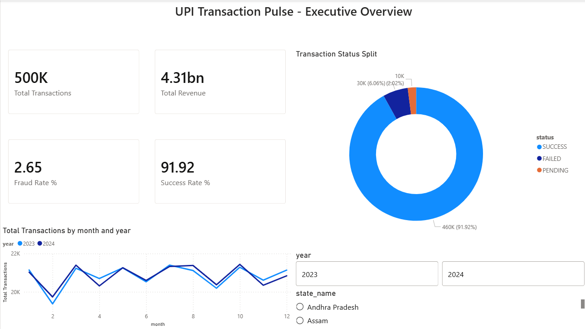
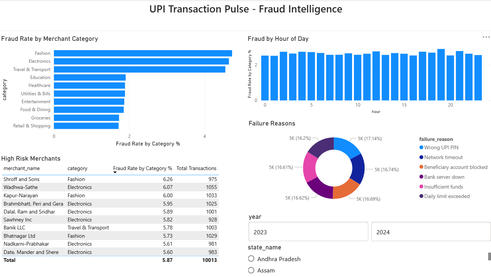
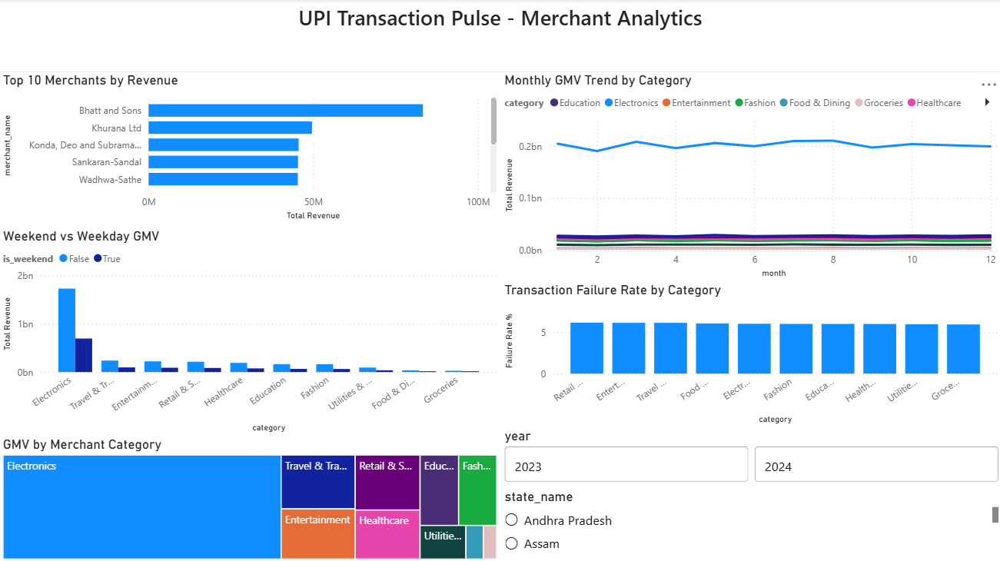
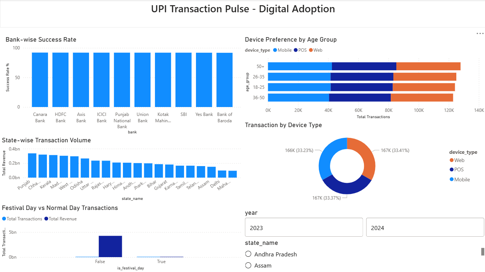

# UPI Transaction Pulse 💳
### Fraud Pattern & Merchant Analytics Dashboard



## Project Overview
An end-to-end data analytics project simulating the analytics layer that 
fintech data teams build internally. Uses RBI aggregate data patterns and 
realistic transaction simulation to model fraud patterns, merchant performance, 
and UPI digital adoption trends across India.

> Transaction-level data is simulated to mirror RBI aggregate patterns — 
> methodology fully documented in `data/raw/rbi_reference.md`

---

## Live Dashboard Screenshots
| Page | Preview |
|------|---------|
| Executive Overview |  |
| Fraud Intelligence |  |
| Merchant Analytics |  |
| Digital Adoption |  |

---

## Key Insights Found
- **Electronics and Travel** have the highest fraud rates (~4–5%) vs platform average of 2.65%
- **Wrong UPI PIN** is the #1 failure reason (18.89%), suggesting UX improvement opportunity
- **Electronics GMV dominates** at ~35% of total platform revenue
- **Festival days** show a significant transaction spike vs normal days
- **HDFC and ICICI** lead in transaction success rates among all banks
- **Mobile, Web and POS** each account for ~33% of transactions equally

---

## Tech Stack
| Layer | Tools |
|-------|-------|
| Data Generation | Python 3.12, Faker, NumPy, Pandas |
| Database | PostgreSQL 17 |
| Data Modelling | Star Schema (5 tables) |
| SQL Analysis | 17 advanced queries (CTEs, Window Functions, RFM) |
| Visualisation | Power BI Desktop |
| Version Control | Git, GitHub |

---

## Architecture


---

## Database Schema

### Fact Table
- `transactions` — 500K UPI transactions with fraud flags, status, amount, device type

### Dimension Tables
- `merchants` — 500 merchants across 10 categories and 20 states
- `users` — 5,000 users with age group, gender, bank, state
- `states` — 20 Indian states with region and tier classification
- `time_dim` — hourly time dimension with festival day flags (2023–2024)

---

## SQL Analysis (17 Queries)

### Fraud Analysis (`02_fraud_analysis.sql`)
1. Fraud rate by merchant category with risk ranking
2. Fraud by hour of day — peak fraud detection
3. Repeat fraud sender identification
4. Fraud amount distribution vs legitimate transactions
5. State-wise fraud heatmap
6. Festival day vs normal day fraud comparison

### Merchant Analysis (`03_merchant_analysis.sql`)
7. Top 10 merchants by revenue
8. Month-over-month GMV growth using LAG()
9. Failed transaction rate and lost revenue by merchant
10. Average basket size by category and city tier
11. Weekend vs weekday GMV by category

### User Behaviour & Adoption (`04_user_behaviour.sql`)
12. Monthly active users trend
13. RFM segmentation (Champion / Loyal / Potential / At Risk)
14. Device preference by age group using window functions
15. Peak transaction hours by user value segment
16. Bank-wise success rate comparison
17. Failure reason breakdown with percentage share

---

## How to Run

### 1. Clone the repository
```bash
git clone https://github.com/vkumar005/upi-transaction-pulse.git
cd upi-transaction-pulse
```

### 2. Set up virtual environment
```bash
python -m venv venv
venv\Scripts\activate        # Windows
pip install -r requirements.txt
```
### 3. Configure environment variables
Create a `.env` file in the root folder:
```
DB_HOST=localhost
DB_PORT=5432
DB_NAME=upi_analytics
DB_USER=postgres
DB_PASSWORD=your_password
```

### 4. Set up PostgreSQL
```sql
CREATE DATABASE upi_analytics;
```
Then run `sql/01_schema.sql` in pgAdmin.

### 5. Generate and load data (~3 minutes)
```bash
python scripts/generate_data.py
```
This generates and loads:
- 20 states, 500 merchants, 5,000 users
- 17,521 time dimension rows
- 500,000 transactions with realistic fraud patterns

### 6. Run SQL analysis
Run in pgAdmin in this order:
sql/02_fraud_analysis.sql
sql/03_merchant_analysis.sql
sql/04_user_behaviour.sql
### 7. Open Power BI dashboard
- Open `dashboard/upi_pulse.pbix` in Power BI Desktop
- Connect to your local PostgreSQL when prompted
- Use year and state slicers to filter all 4 pages

---
## Project Structure
```
upi-transaction-pulse/
├── architecture/
│   └── architecture.png
├── data/
│   ├── raw/
│   │   └── rbi_reference.md
│   └── generated/
├── sql/
│   ├── 01_schema.sql
│   ├── 02_fraud_analysis.sql
│   ├── 03_merchant_analysis.sql
│   └── 04_user_behaviour.sql
├── scripts/
│   ├── generate_data.py
│   ├── load_to_postgres.py
│   └── test_connection.py
├── notebooks/
│   └── eda.ipynb
├── dashboard/
│   └── README.md
├── screenshots/
│   ├── 01_executive_overview.png
│   ├── 02_fraud_intelligence.png
│   ├── 03_merchant_analytics.png
│   └── 04_digital_adoption.png
├── .env
├── .gitignore
├── requirements.txt
├── RUNBOOK.md
└── README.md
```
---

## Author
**Venkatesan Kumar**
- 📧 kumarvenkatesan08@gmail.com
- 💼 [LinkedIn](https://linkedin.com/in/venkatesankumar)
- 🐙 [GitHub](https://github.com/vkumar005)