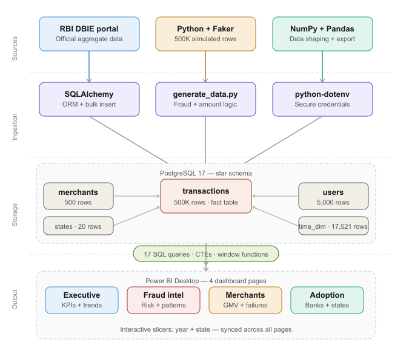

# RUNBOOK — UPI Transaction Pulse

Operational guide for running, maintaining, and extending this project.

## Architecture


---

## Environment Setup

### Prerequisites
- Python 3.12+
- PostgreSQL 17
- Power BI Desktop
- Git

### First Time Setup
```bash
# 1. Clone repo
git clone https://github.com/vkumar005/upi-transaction-pulse.git
cd upi-transaction-pulse

# 2. Create and activate venv
python -m venv venv
venv\Scripts\activate

# 3. Install dependencies
pip install -r requirements.txt

# 4. Create .env file with DB credentials
# (see README for format)

# 5. Test DB connection
python scripts/test_connection.py
```

---

## Database Operations

### Create fresh database
```sql
-- Run in pgAdmin
CREATE DATABASE upi_analytics;
```

### Create schema
Run sql/01_schema.sql in pgAdmin
### Drop and recreate all tables
```sql
-- Run in pgAdmin if you need a clean slate
DROP TABLE IF EXISTS transactions CASCADE;
DROP TABLE IF EXISTS merchants CASCADE;
DROP TABLE IF EXISTS users CASCADE;
DROP TABLE IF EXISTS states CASCADE;
DROP TABLE IF EXISTS time_dim CASCADE;

-- Then re-run sql/01_schema.sql
```

### Check row counts
```sql
SELECT 'states'        AS table_name, COUNT(*) FROM states
UNION ALL
SELECT 'merchants',    COUNT(*) FROM merchants
UNION ALL
SELECT 'users',        COUNT(*) FROM users
UNION ALL
SELECT 'time_dim',     COUNT(*) FROM time_dim
UNION ALL
SELECT 'transactions', COUNT(*) FROM transactions;
```

---

## Data Generation

### Generate all data (first time)
```bash
python scripts/generate_data.py
```
Expected output:
States:            20
Merchants:        500
Users:          5,000
Time rows:     17,521
Transactions: 500,000
Expected time: 3–5 minutes

### Regenerate with different seed
Open `generate_data.py` → change line:
```python
random.seed(42)   # change 42 to any number
np.random.seed(42)
```
Then drop tables and rerun.

---

## SQL Analysis

### Run all analysis queries
Run in pgAdmin in this order:
1. `sql/02_fraud_analysis.sql` — 6 fraud queries
2. `sql/03_merchant_analysis.sql` — 5 merchant queries
3. `sql/04_user_behaviour.sql` — 6 behaviour queries

### Quick fraud check
```sql
SELECT 
    ROUND(SUM(CASE WHEN is_fraud THEN 1 ELSE 0 END) * 100.0 / COUNT(*), 2) AS fraud_rate_pct,
    ROUND(SUM(CASE WHEN status = 'SUCCESS' THEN 1 ELSE 0 END) * 100.0 / COUNT(*), 2) AS success_rate_pct
FROM transactions;
```
Expected: fraud ~2.65%, success ~91.92%

---

## Power BI Dashboard

### Open dashboard
1. Open `dashboard/upi_pulse.pbix` in Power BI Desktop
2. If prompted for credentials: use your PostgreSQL username and password
3. Click Refresh if data doesn't load automatically

### Dashboard pages
| Page | Key Visuals |
|------|-------------|
| Executive Overview | 4 KPI cards, line chart, donut chart |
| Fraud Intelligence | Bar chart, column chart, table, donut |
| Merchant Analytics | Bar chart, treemap, line chart, column charts |
| Digital Adoption | Column charts, donut, stacked bar |

### Slicers
- **Year** (button slicer): 2023 / 2024 — synced across all pages
- **State** (list slicer): all 20 Indian states — synced across all pages

### DAX Measures
| Measure | Formula |
|---------|---------|
| Total Transactions | COUNTROWS('public transactions') |
| Total Revenue | SUM('public transactions'[amount]) |
| Fraud Rate % | DIVIDE(fraud rows, total rows) * 100 |
| Success Rate % | DIVIDE(SUCCESS rows, total rows) * 100 |
| Fraud Rate by Category % | Same as Fraud Rate filtered by category |
| Failure Rate % | DIVIDE(FAILED rows, total rows) * 100 |

---

## EDA Notebook

### Run EDA
```bash
# Make sure venv is active
venv\Scripts\activate

# Open in VS Code
code notebooks/eda.ipynb
# Select venv kernel → Run All
```

---

## Git Workflow

### Daily commit
```bash
git add .
git commit -m "description of what you changed"
git push origin main
```

### Useful git commands
```bash
git status          # see what changed
git log --oneline   # see commit history
git diff            # see exact changes
```

---

## Troubleshooting

| Problem | Solution |
|---------|----------|
| DB connection failed | Check .env credentials, ensure PostgreSQL service is running |
| ipykernel error in notebook | Run: `pip install ipykernel` in venv |
| Power BI can't connect | Use `localhost:5432` not just `localhost` |
| Tables show no data | Check you ran generate_data.py successfully |
| Git push rejected | Run `git pull origin main` first then push |

---

## Extending the Project

### Add more data
- Increase `NUM_TRANSACTIONS` in `generate_data.py` to 1M+
- Add more merchant categories in `MERCHANT_CATEGORIES` list
- Add more states to `STATES` list

### Add new SQL queries
- Create `sql/05_advanced_analysis.sql`
- Add queries for cohort analysis, funnel analysis, or churn prediction

### Add new dashboard page
- Add Page 5 in Power BI
- Theme: "User Segmentation" using RFM scores from Query 13